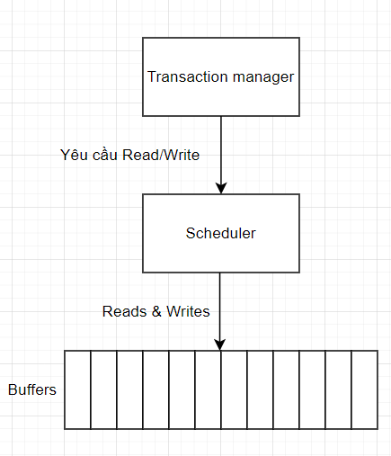
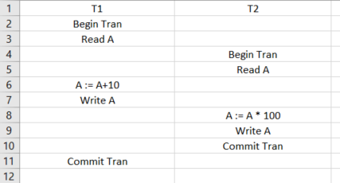
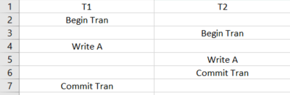
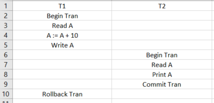
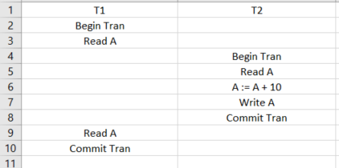
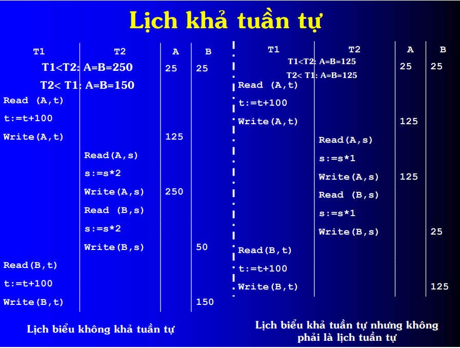
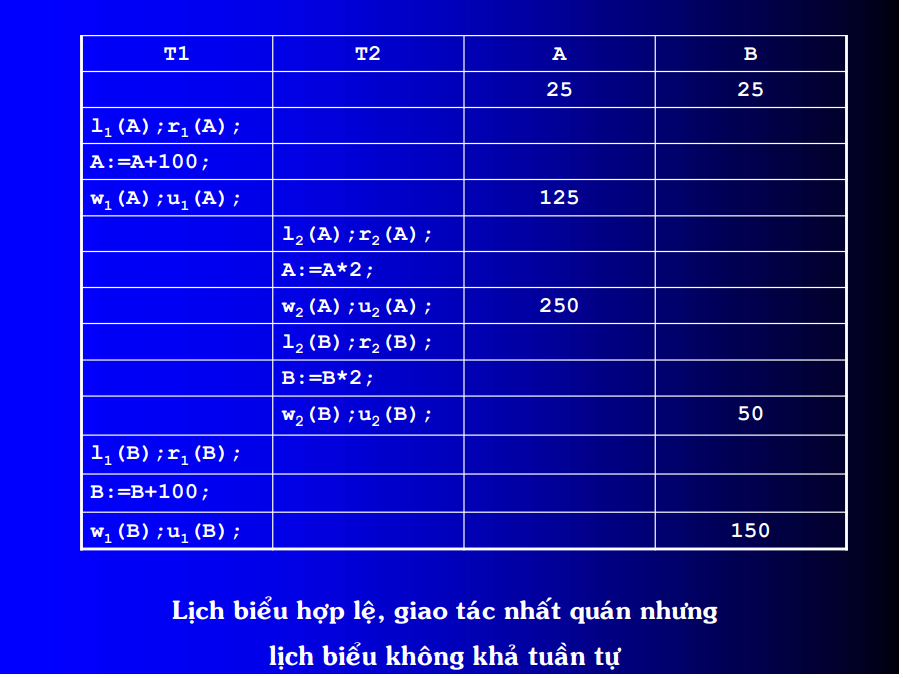
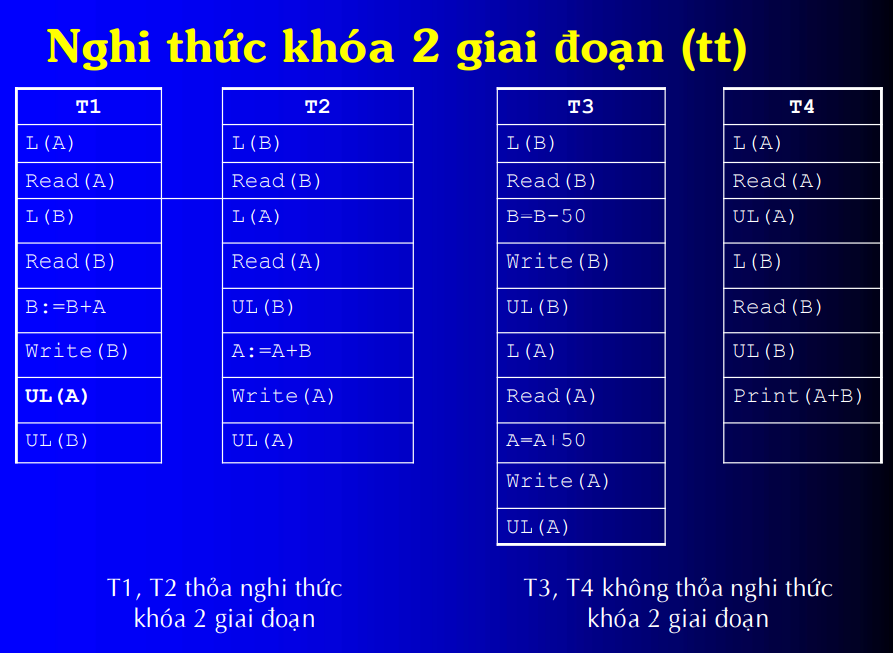
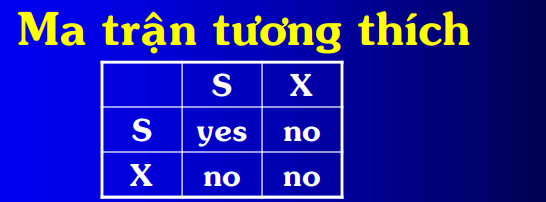
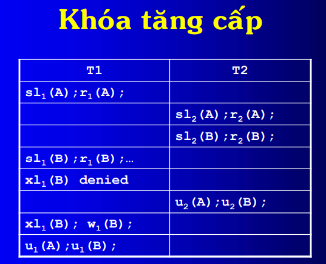

# GIAO TÁC - ĐIỀU KHIỂN ĐỒNG THỜI (T-SQL)

## Giao tác
- Là 1 tập hợp các thao tác có thứ tự truy xuất dữ liệu trên CSDL thành 1 đơn vị công việc logic, chuyển CSDL từ trạng thái nhất quán này sang trạng thái nhất quán khác.
## Điều khiển đồng thời
- Lý do: Đảm bảo nhiều giao tác thực hiện đồng thời mà vẫn đảm bảo tính đúng đắn trên CSDL.

  - Scheduler nhận yêu cầu Read/Write từ các giao tác và điều khiển: cho thực thi hoặc chờ hoặc hủy giao tác tùy vào kỹ thuật điều khiển đồng thời được cài đặt.
**Các vấn đề của điều khiển đồng thời**
- Mất dữ liệu cập nhật (Lost update)
 - TH1: 
    
 - TH2:
    
- Đọc dữ liệu chưa commit (Uncommit data, Dirty read)
    
- Thao tác đọc không thể lặp lại (Unrepeatable data)
    
- Phantom
    
## Lịch thao tác
#### Các khái niệm
- Hoạt động của các giao dịch đồng thời được coi là đúng đắn nếu và chỉ nếu tác dụng của nó giống như tác dụng có được khi cho chúng thực hiện 1 cách `tuần tự`.
- Lịch biểu (`schedule`): Một lịch biểu là một chuỗi sắp theo thời gian các hành động được thực hiện bởi một hoặc nhiều giao tác.
- Lịch biểu tuần tự (`serial`)  nếu thứ tự thực hiện các thao tác trong lịch biểu là tất cả các thao tác của giao tác này rồi đến tất cả các thao tác của giao tác khác và cứ như vậy. Mọi lịch biểu tuần tự điều đảm bảo tính nhất quán cho cơ sở dữ liệu.
- Lịch biểu khả tuần tự (`serializable`) nếu tác dụng của nó giống như tác dụng của một lịch biểu tuần tự nào đó. Tức là chúng sinh ra cùng một giá trị cho mỗi đơn vị dữ liệu.
VD: 
- Lịch biểu có thể phục hồi được (`Recoverable Schedule`): Mọi HQT CSDL yêu cầu lịch biểu phải có thể phục hồi được. Một lịch biểu có thể phục hồi được là lịch biểu mà mọi cặp Ti, Tj khi Tj đọc đơn vị dữ liệu vừa được ghi bởi Ti, thao tác commit của Ti phải xuất hiện trước thao tác commit của Tj
- Lịch biểu không rollback dây chuyền (`Uncascading rollback Schedule`): Lịch biểu không rollback dây chuyền là lịch biểu mà trong đó mọi cặp giao tác Ti, Tj, nếu Tj đọc đơn vị dữ liệu được viết trước đó bởi Ti, thao tác commit của Ti phải xuất hiện trước thao tác đọc của Tj. 
- Tính ` tương thích ` của 2 thao tác: Thao tác Oi, Oj là tương thích nếu kết quả của việc thực hiện đồng thời Oi, Oj giống như kết quả của việc thực hiện tuần tự Oi, Oj hoặc Oj, Oi.
- ` Bộ lập lịch ` (Schedulers): sẽ tiến hành lập lịch các thao tác (thao tác nào được thực hiện trước, thao tác nào sẽ được thực hiện sau). Bộ lập lịch giải quyết các yêu cầu đụng độ, ép các transaction phải chờ trong trường hợp không đáp ứng được yêu cầu lock hoặc hủy bỏ các transaction. Bộ lập lịch là thành phần của hệ quản trị CSDL, có vai trò làm trọng tài phân xử các yêu cầu có xung đột.
- Nghi thức `protocol`: là một hạn chế trên chuỗi các bước nguyên tử mà một giao dịch có thể thực hiện. Ví dụ: Nghi thức giải quyết vấn đề deadlock (yêu cầu các giao tác lock các đơn vị dữ liệu theo 1 thứ tự cố định nào đó), nghi thức đảm bảo tính khả tuần tự (chiến lực lock 2 pha).
## Điều khiển đồng thời dùng kỹ thuật khóa
#### Các Kĩ thuật khóa:
- Kỹ thuật khóa đơn giản: Lock (A), Unlock (A)
- Nghi thức khóa 2 giai đoạn (2PL)
- Kỹ thuật khóa Đọc / Ghi: Rlock(A), Wlock(A), Unlock(A)
  - Tăng cấp (upgrading)
  - Khóa cập nhật (update lock)
  - Khóa tăng / giảm (increment lock)
  - Khóa trên dvdl có kích thước khác nhau.
- Nghi thức khóa trên dvdl tổ chức phân cấp.
##### Kỹ thuật khóa đơn giản
- Bộ lập lịch dùng kỹ thuật khóa yêu cầu:
  - Phải khóa và nhả khóa ngoài việc Đọc/ghi dữ liệu
  - Việc dùng khóa phải tuân theo 2 điều kiện:
    - Tính nhất quán của giao tác:
      - Giao tác chỉ có thể được đọc hoặc ghi trên đơn vị dữ liệu nếu trước đó có yêu cầu lock trên đơn vị dữ liệu và chưa nhả lock.
      - Nếu giao tác đã lock trên dvdl thì sau đó phải unlock
    - Tính hợp lệ của lịch biểu:
      - Không thể có 2 giao tác đồng thời khóa trên 1 dvdl.

##### Nghi thức khóa 2 giai đoạn (Two-phase lock Protocal - 2PL)
- Phát biểu: Một giao tác thực hiện cơ chế khóa 2 giai đoạn khi giao tác không thực hiện lock nào nữa sau khi đã unlock.

=> **Hạn chế** của phương pháp điều khiển đồng thời dùng khóa:
  - Livelock: tính trạng 1 giao tác chờ hoài để được làm việc trên 1 dvdl.
  - Deadlock: Tình trạng 2 giao tác cứ chờ nhau mãi để được làm việc trên cùng một đơn vị dữ liệu mà không có giao tác nào có thể thực hiện trước.
#### Các phương thức khóa.
-  **Share lock (S)** (Read lock)"
    - Khi đọc 1 đơn vị dữ liệu, SQL Server tự động thiết lập Shared Lock trên đơn vị dữ liệu đó.
    - Có thể được thiết lập trên 1 bảng, 1 trang, 1 khóa hay trên 1 dòng dữ liệu.
    - Nhiều giao tác có thể đồng thời giữ Shared Lock trên cùng 1 đơn vị dữ liệu.
    - Không thể thiết lập Exclusive Lock trên đơn vị dữ liệu đang có Shared Lock.
    - Shared Lock thường được giải phóng ngay sau khi sử dụng xong dữ liệu được đọc, trừ khi có yêu cầu giữ shared lock đến hết giao tác.
- **Exclusive Lock (X)**: (Write lock)
    - Khi thực hiện thao tác ghi (insert, update, delete) trên 1 đơn vị dữ liệu, SQL Server tự động thiết lập Exclusive Lock trên đơn vị dữ liệu đó.
    - Exclusive Lock luôn được giữ đến hết giao tác.
    - Tại 1 thời điểm, chỉ có tối đa 1 giao tác được quyền giữ exclusive lock trên 1 đơn vị dữ liệu.
#### Nguyên tắc khóa
- Tính nhất quán của giao tác
    - Thao tác đọc ri(X) phải đi sau sli(X) hoặc xli(X) mà không có thao tác ui(X) xen vào giữa.
    - Thao tác ghi wi(X) phải đi sau xli(X) mà không có thao tác ui(X) nào xem vào giữa.
    - Tất cả các lock phải được unlock trên cùng dvdl.
- Giao tác thỏa 2PL:
    - Không có thao tác ui(Y) nào đi trước sli(X) hoặc xli(X).
- Lịch biểu hợp lệ.
    - Nếu có thao tác xli(X) trong lịch biểu thì không thể có xlj(X) hoặc slj(X) theo sau, j != i mà không có lệnh ui(X) nào ở giữa.
    - Nếu có thao tác sli(X) trong lịch biểu thì không thể có xlj(X) theo sau, j != i mà không có lệnh ui(X) ở giữa.
    
#### Khóa tăng cấp
- Shared lock: Thân thiện
- T muốn đọc X trước, sau đó ghi X thì trước tiên khóa đọc trên X, sau đó khi muốn ghi thì nâng cấp (upgrade) khóa đọc thành khóa ghi. Giao tác hoàn toàn có thể yêu cầu lock trên cùng một dvdl với nhiều chế độ lock khác nhau.
- Cách này cho phép tăng tính đồng thời.

- update lock sử dụng khi đọc dữ liệu với dự định ghi trở lại trên đơn vị dữ liệu này.
- Uli(X) chỉ cho phép giao tác Ti quyền đọc trên X, không cho phép Ti quyền ghi trên X. Tuy nhiên, chỉ có update lock mới cho phép có thể được nâng cấp lên thành khóa độc quyền sau đso, khóa đọc thì không thể nâng cấp.
- Update lock là chế độ khóa trung gian giữa Shared Lock và Exclusive Lock.
- Update Lock giúp tránh deadlock mà khóa tăng cấp gặp phải.
- Khi thực hiện thao tác ghi lên 1 đơn vị dữ liệu thì bắt buộc Update Lock phải được nâng cấp thành Exclusive Lock.
- Tại 1 thời điểm chi cho phép 1 giao tác giữ Update Lock trên 1 dvdl