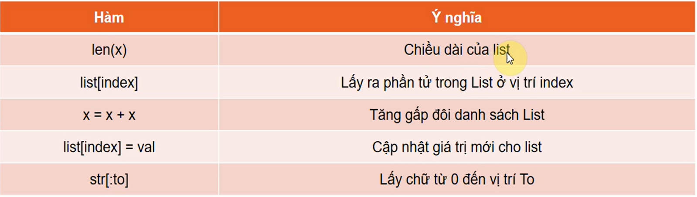
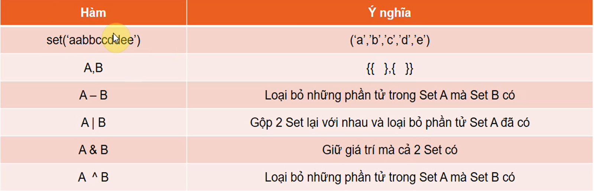

# KHÁI NIỆM CƠ BẢN
### Python object
- Trong python tất cả mọi thứ đề là một đối tượng (Object). Kiểu chuỗi (Strings), kiểu số (Numbers) và kiểu logic (Booleans) cũng được coi là một đối tượng.
- Đối tượng Object được xem như một ô chứa dữ liệu bên trong.
- Kiểu số (Number), kiểu chuỗi (String), và kiểu logic (Boolean) chỉ chứa được 1 giá trị duy nhất.
- Tuples, Lists, Set, Dictionaries có thể chứa được 1 hoặc nhiều giá trị.
- `Name, Type và ID`:
  - Mỗi đối tượng (object) sẽ có tên (Name), loại (Type), và mã số (ID).
  - Mã số (ID)  và loại (Type) sẽ không được thay đổi trong suốt vòng đời của 1 đối tượng.
  - Hàm: type() và id()
- `Object Names`:
  - Tên của đối tượng bao gồm chữ, số và dấu gạch chân.
  - Tên của đối tượng không được phép bắt đầu bằng số.
### Phép so sánh
- Các phép so sánh `<, >, <=, >=, ==, !=`
- Kiểm tra đối tượng này có phải là đối tượng kia: `is`
- Kiểm tra đối tượng này có nằm trong dãy kí tự: `in`
### Các loại container: Lists, Tuples, Sets, Dictionary
- Tuple: ``` tuple = (1, 2, 3, 4) ```
- List: ```list = ["123", "teo", 1, 4]```
- Set: `set = {"123", "4", 2}`
- Dict: `dic = {"n1":"Conan Vu", "n2":"Kenny Huy", "n3":"An Vu"}`
### Phép gán kết hợp

## Biểu thức trong lập trình Python
### Mệnh đề điều kiện
```
diem = 6
if diem > 8:
    print("Mẹ mua xe SH")
elif diem <= 8 and diem >= 6
    print("Mẹ mua xe Dream")
else:
    print("Mẹ mua xe bánh mì")
```
### Vòng lặp while
```
n = 1
while (n <= 10):
    print(n)
    n = n + 1
```
### Vòng lặp for
- for trong python là lặp phần tử trong 1 object
```
t = (1, 2, 3, 4, 5)
for n in t:
    print(n, end = ' ')
```
### Sự khác biệt giữa continue và break
- Continue là tiếp tục chạy
- Break là thoát vòng lặp ngay lập tức.
## Đối tượng String trong Python
#### String object basic
- Chiều dài chuỗi: 
```
name = "Vũ Quốc Tuấn"
len(name) // 12
name[3] // Q
name[-3] // u
name[3:7] // Quốc
name[3:] // Quốc Tuấn
```
#### Một số hàm String
```
name = "vũ quốc tuấn"
name.capitalize() // Vũ quốc tuấn
name.upper() // VŨ QUỐC TUẤN
name.lower() // vũ quốc tuấn
name.swapcase() // VŨ QUỐC TUẤN
chuoi = "Python"
chuoi.ljust(10,"*") // 'Python****'
chuoi.ljust(10, "*-") // Error vì chỉ đc them 1 kí tự
chuoi.rjust(10,"*") // '****Python'
chuoi.center(14,"*") // '****Python****'

nhap = '              đây là nội dung'
len(nhap) // 36
nhap.lstrip() // đây là nội dung
nhap.rstrip()
nhap.strip()
```

#### Sử dụng split và join để thao tác với string

#### Tìm hiểu phương thức format trong String


## Đối tượng List, Tuples, Sets và Dictionary
#### Tìm hiểu về đối tượng List trong python
- Các funtion trong list


- Tối ưu mã nguồn trong List


#### Tìm hiểu đối tượng Tuples
- Không thể thay đổi giá trị 1 phần tử trong Tuples.
- Tương tự List
#### Tìm hiểu về Sets
- Set ko cho phép indexing.
- Set tự động sắp xếp
- Set không hỗ trợ các giá trị lặp

#### Tìm hiểu về Dictionary


- Dictionary khi thay thế giá trị thì nó sẽ sắp xếp lại cho chúng ta. Khác với List khi thay thế sẽ không sắp xếp lại.
- Function: `in` chỉ kiểm tra key, `not in`, `clear`, `pop` xóa phần tử có key là ...., `popitem` là xóa phần tử ngẫu nhiên, 
